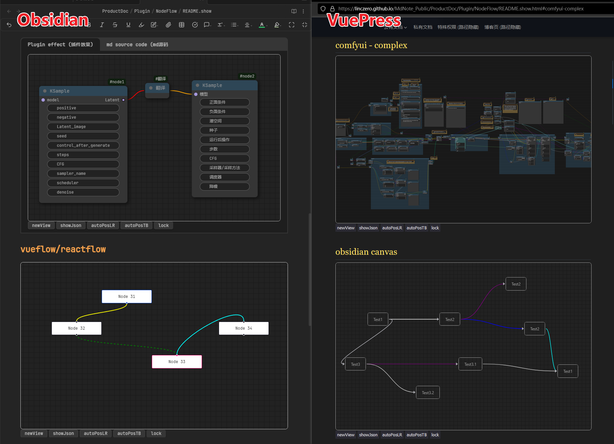

# Obsidian NodeFlow

Render node streams like `ComfyUi`, `UE`, `Houdini`, `Blender`, etc., to make it easy to write relevant notes.<br>渲染节点流，像 `ComfyUi`, `UE`, `Houdini`, `Blender` 等，使其易于编写相关笔记。

The plugin allows diagrams to be described using lightweight syntax or Json, and is available in both Obsidian and VuePress blogs<br>允许使用轻量语法或Json描述了图表，该插件在Obsidian与VuePress博客中均可使用

## Docs

Tutorials, online effects, use cases, and more (教程、在线效果、用例等)

- [Online effects (在线效果)](https://linczero.github.io/MdNote_Public/ProductDoc/Plugin/NodeFlow/README.show.html)

## Usage

### 方式一：使用代码块

```json
[
  "nodeflow-test",
  "nodeflow-vueflow", "nodeflow-vueflow-demo", "nodeflow-vueflow-demo2", "nodeflow-vueflow-demo3",
  "nodeflow-obcanvas", "nodeflow-obcanvas-demo",
  "nodeflow-comfyui", "nodeflow-comfyui-demo", "nodeflow-comfyui-demo2",
  "nodeflow-list", "nodeflow-list-demo"
]
```

这些代码块的类型都不太一样

1. nodeflow-comfyui 前缀的，使用comfyui软件导出的工作流json作为内容
2. nodeflow-obcanvas 前缀的，使用obsidian canvas文件的内容 (用记事本打开，会发现里面是一个json格式)
3. nodeflow-list 前缀的，表示这是一个对标mermaid/plantuml的，用轻文字描述图表的格式。具体语法参考 [NodeFlow List Grammer](https://linczero.github.io/MdNote_Public/ProductDoc/Plugin/NodeFlow/docs/zh/NodeFlow%20List%20Grammer.html)

### 方式二

直接将comfyui的导出workflow.json文件放在库里，会自动识别json后缀的

### 方式三

直接将comfyui的导出workflow.json文件扩展名修改成`.workflow_json`，也能正确识别

## Effect display (Partial) (效果展示 - 部分)


